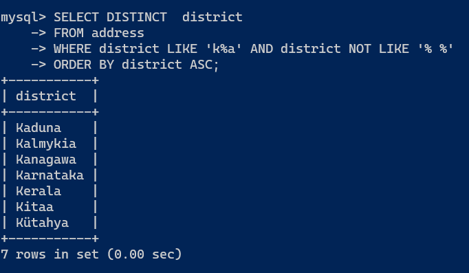
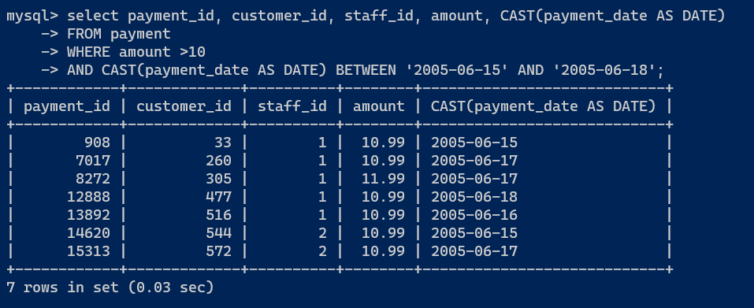
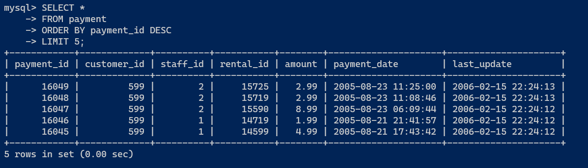

# Домашнее задание к занятию "`12-03hw`" - `Ливчак Сергей`

---

### Задание 1

`Получите уникальные названия районов из таблицы с адресами, которые начинаются на “K” и заканчиваются на “a” и не содержат пробелов.`

1. `DISTINCT позволяет убрать повторения.`
2. `ORDER BY ___ ASC позволяет отсортировать в алфавитном прядке`

```
SELECT DISTINCT  district 
FROM address
WHERE district LIKE 'k%a' AND district NOT LIKE '% %'
ORDER BY district ASC;

```
1. **Скриншот из консоли задание 1** 


---

### Задание 2

`Получите из таблицы платежей за прокат фильмов информацию по платежам, которые выполнялись в промежуток с 15 июня 2005 года по 18 июня 2005 года включительно и стоимость которых превышает 10.00.`

1. `Оператором Select выбираем из табилцы payment колонки`
2. `Задаём ограничение по amount`
3. `Выражаем колонку paymetn_date из формата datatime в формат date`
4. `Оператор BETWEEN позволяет выразить диапазон дат "включительно"`

```
SELECT payment_id, customer_id, staff_id , rental_id ,  amount, CAST(payment_date AS DATE) 
FROM payment
WHERE amount > 10 
AND CAST(payment_date AS DATE) BETWEEN '2005-06-15' AND '2005-06-18';

```
2. **Скриншот из консоли задание 2** 


---

### Задание 3

`Получите последние пять аренд фильмов.`

1. `Для сортировки с конца нужно использовать DESC с оператором ORDER BY `

```
SELECT * 
FROM payment
ORDER BY payment_id DESC 
LIMIT 5;

```

3. **Скриншот из консоли задание 3** 


### Задание 4

`Приведите ответ в свободной форме........`

1. `Заполните здесь этапы выполнения, если требуется ....`
2. `Заполните здесь этапы выполнения, если требуется ....`
3. `Заполните здесь этапы выполнения, если требуется ....`
4. `Заполните здесь этапы выполнения, если требуется ....`
5. `Заполните здесь этапы выполнения, если требуется ....`
6. 

```
Поле для вставки кода...
....
....
....
....
```

`При необходимости прикрепитe сюда скриншоты
`

---
## Дополнительные задания (со звездочкой*)

Эти задания дополнительные (не обязательные к выполнению) и никак не повлияют на получение вами зачета по этому домашнему заданию. Вы можете их выполнить, если хотите глубже и/или шире разобраться в материале.

### Задание 5

`Приведите ответ в свободной форме........`

1. `Заполните здесь этапы выполнения, если требуется ....`
2. `Заполните здесь этапы выполнения, если требуется ....`
3. `Заполните здесь этапы выполнения, если требуется ....`
4. `Заполните здесь этапы выполнения, если требуется ....`
5. `Заполните здесь этапы выполнения, если требуется ....`
6. 

`При необходимости прикрепитe сюда скриншоты
`
