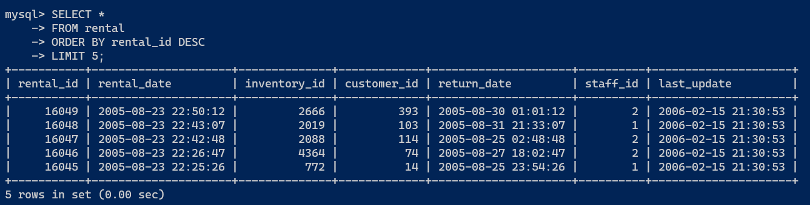
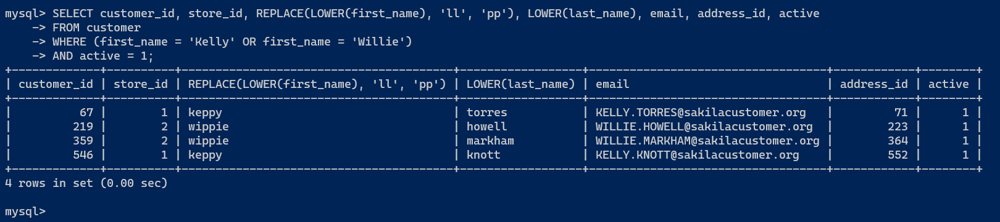
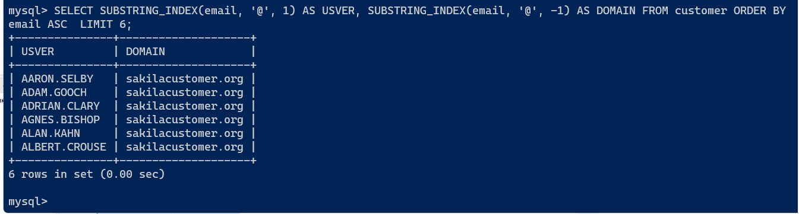

# Домашнее задание к занятию "`12-03hw`" - `Ливчак Сергей`

---

### Задание 1

`Получите уникальные названия районов из таблицы с адресами, которые начинаются на “K” и заканчиваются на “a” и не содержат пробелов.`

1. `DISTINCT позволяет убрать повторения.`
2. `ORDER BY ___ ASC позволяет отсортировать в алфавитном прядке`

```
SELECT DISTINCT  district 
FROM address
WHERE district LIKE 'k%a' AND district NOT LIKE '% %'
ORDER BY district ASC;

```
1. **Скриншот из консоли задание 1** 


---

### Задание 2

`Получите из таблицы платежей за прокат фильмов информацию по платежам, которые выполнялись в промежуток с 15 июня 2005 года по 18 июня 2005 года включительно и стоимость которых превышает 10.00.`

1. `Оператором Select выбираем из табилцы payment колонки`
2. `Задаём ограничение по amount`
3. `Выражаем колонку paymetn_date из формата datatime в формат date`
4. `Оператор BETWEEN позволяет выразить диапазон дат "включительно"`

```
SELECT payment_id, customer_id, staff_id , rental_id ,  amount, CAST(payment_date AS DATE) 
FROM payment
WHERE amount > 10 
AND CAST(payment_date AS DATE) BETWEEN '2005-06-15' AND '2005-06-18';

```
2. **Скриншот из консоли задание 2** 


---

### Задание 3

`Получите последние пять аренд фильмов.`

1. `Для сортировки с конца нужно использовать DESC с оператором ORDER BY `

```
SELECT * 
FROM rental
ORDER BY rental_id DESC 
LIMIT 5;

```

3. **Скриншот из консоли задание 3** 


### Задание 4

`Одним запросом получите активных покупателей, имена которых Kelly или Willie.`
`Сформируйте вывод в результат таким образом: все буквы в фамилии и имени из верхнего регистра переведите в нижний регистр, замените буквы 'll'в именах на 'pp'.`

1. `Предварительно заглянул в таблицу customer и выписал колонки`
2. `По условию нам нужны из колонки first_name пару имён при условии что это активные покупатели - используем оператор WHERE и AND для соблюдения обоих условий`
3. `Заменяем в строках символы и в выводе делаем их маленькими`

```
SELECT customer_id, store_id, REPLACE(LOWER(first_name), 'll', 'pp'), LOWER(last_name), email, address_id, active 
FROM customer
WHERE (first_name = 'Kelly' OR first_name = 'Willie')
AND active = 1;

```

4. **Скриншот из консоли задание 4** 


---

## Дополнительные задания (со звездочкой*)

Эти задания дополнительные (не обязательные к выполнению) и никак не повлияют на получение вами зачета по этому домашнему заданию. Вы можете их выполнить, если хотите глубже и/или шире разобраться в материале.

### Задание 5

`Выведите Email каждого покупателя, разделив значение Email на две отдельных колонки: в первой колонке должно быть значение, указанное до @, во второй — значение, указанное после @.`

1. `Используем оператор SUBSTRING_INDEX с положительным и отрицательным значением`

```
SELECT SUBSTRING_INDEX(email, '@', 1) AS USVER, SUBSTRING_INDEX(email, '@', -1) AS DOMAIN
FROM customer
ORDER BY email ASC 
LIMIT 6;

```
5. **Скриншот из консоли задание 5** 


---


`При необходимости прикрепитe сюда скриншоты
`
